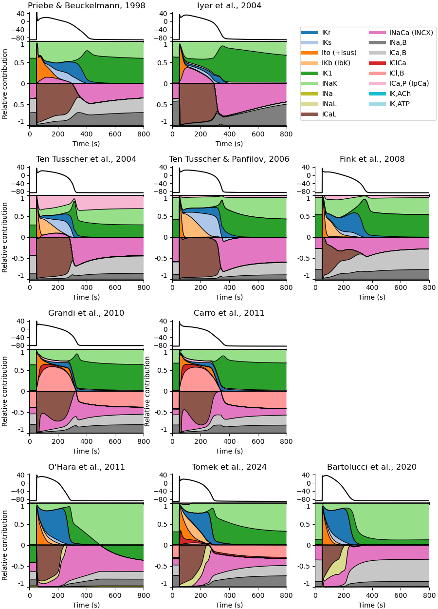
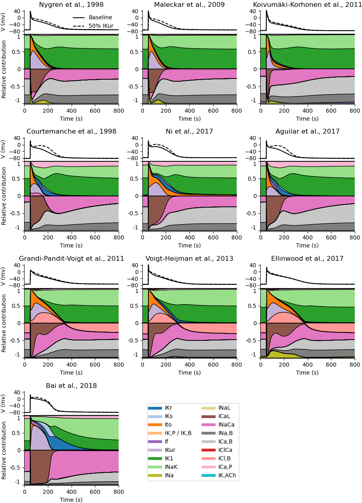
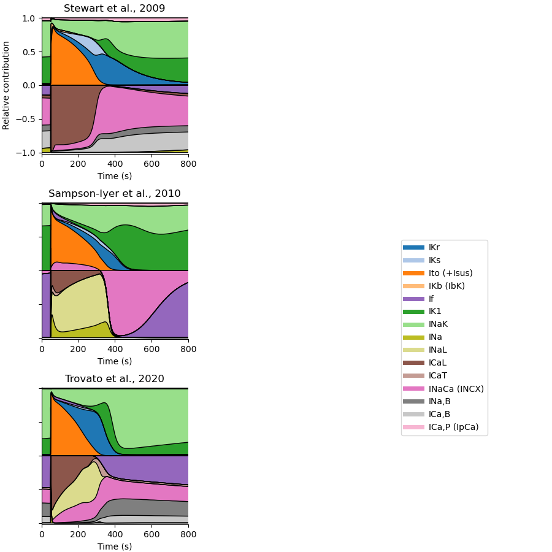
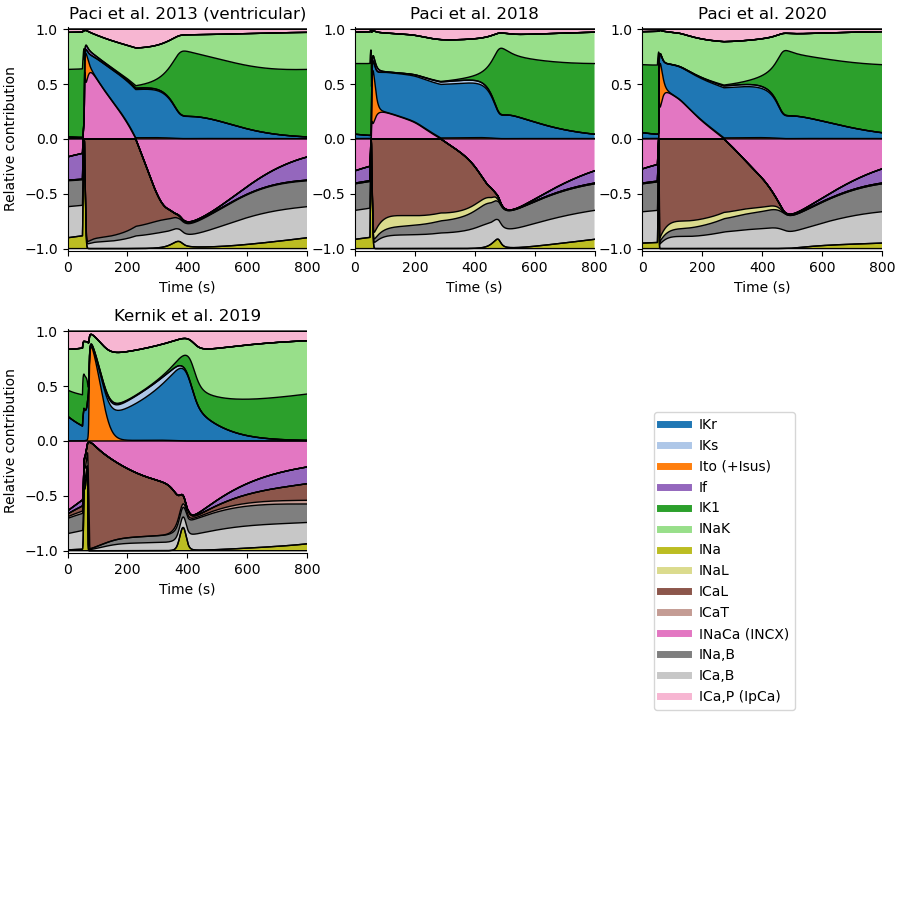
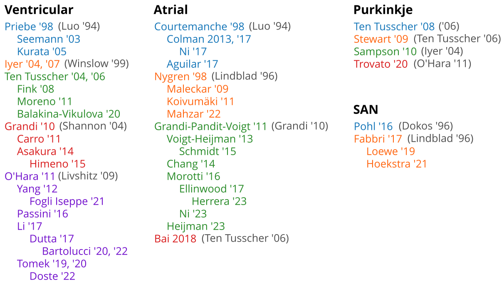

# Relative contributions of ionic currents

Each graph shows the size of the various inward or outward ionic currents _relative to the total inward or outward current at the same time_.
Graphs for each current are "stacked" vertically: no data is hidden. 

The choice of models is based on availability on Michael's computer, and does not reflect an opinion on merit or validity in any way.
Only "human" models are shown.

## Human ventricular

## Human atrial

## Human Purkinje

## hIPSC models

## Methods

- Models were loaded from https://github.com/myokit/models/
- Where necessary, models were configured (e.g. set to epicardial mode) and
  units were converted to ms, mV, and A/F
- Models were pre-paced until `|x[i+1] - x[i]|/s < 1e-5` for all states, where `s` was set to either the range of the variable over a single beat, or to 1 if the range was 0.
  - Models that could not be brought into a steady-state this way were: Priebe & Beuckelman 1998 (ventricular), Koivumaki 2011 (atrial), Stewart 2009 (purkinje), and Kernik 2019 (hipsc).
- Where currents were defined as having multiple components, the sum of all components was used. For example:
  - ICaL for different species and different compartments was summed
  - Ito-fast and Ito-slow were summed
- Ventricular, atrial, and Purkinje models were paced at 1Hz, for 0.5ms with a 50ms offset
- HiPSC models were paced at 0.8Hz, for 5ms with a 50ms offset

## Human models (as of 2024-09-03)

