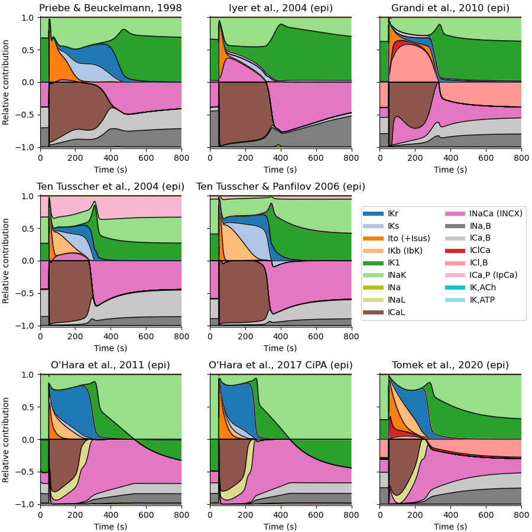
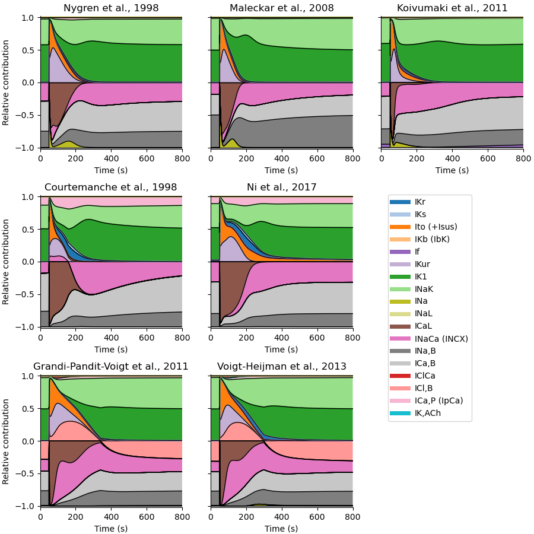

# Relative contributions of ionic currents

Each graph shows the size of the various inward or outward ionic currents _relative to the total inward or outward current at the same time_.
Graphs for each current are "stacked" vertically: no data is hidden. 

The choice of models is based on availability on Michael's computer, and does not reflect an opinion on merit or validity in any way.
Only "human" models are shown.

## Human ventricular

## Human atrial

## Human Purkinje

